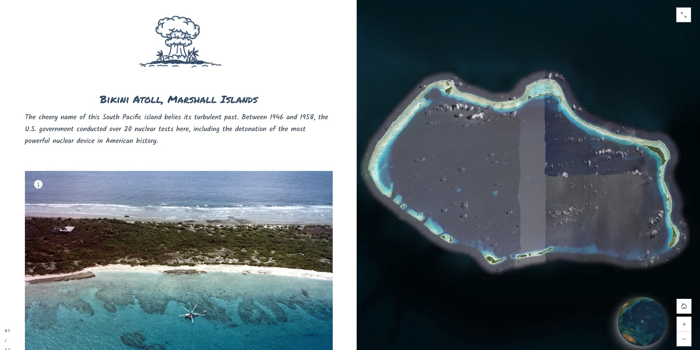

# Custom font
This sample demonstrates how to reference a self-hosted font file and replace the typefaces used within your story with the self-hosted fonts.

This is useful when you want the typefaces of your story to conform to the style guide and fonts used by your organization that may not be available by default in the ArcGIS StoryMaps builder.

<!-- ## Live sample
[](https://codepen.io/Warren-Davison/pen/poMEJpE) -->

## Usage instructions
In order to implement custom fonts for your story, you'll need to:
- Self-host your desired font files or have access to a font delivery service.

### CSS customizations
**Loading fonts from font delivery service**: If using a typeface from a font delivery service, you'll need to reference the font in the `<head>` of our HTML.
```html
<!-- Reference Google Fonts and CSS -->
<link href="https://fonts.googleapis.com/css2?family=Sigmar&family=Sigmar+One&display=swap" rel="stylesheet">
```

**Referencing self-hosted font files**: If using self-hosted fonts, these will be referenced in your CSS file as a `@font-face` and their `src` with be a relative url to the file location on your web server.
```css
/* Reference self-hosted font files */
@font-face {
    font-family: 'Permanent-Marker';
    src: url('./fonts/PermanentMarker/PermanentMarker-Regular.ttf') format('truetype');
}
```