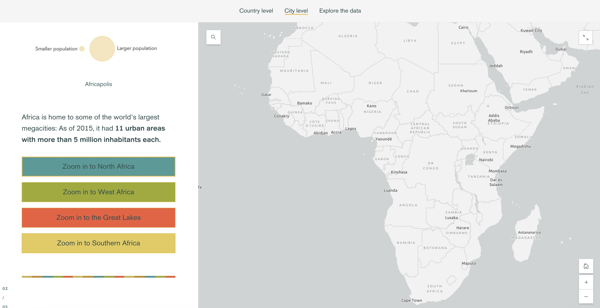

# Custom media actions
This example demonstrates how to customize the appearance of media action buttons to align with a theme or to act as a visual legend when performing map-related actions.

## Live sample
[](https://codepen.io/Warren-Davison/pen/ExqbaKK)
*[Click to see the live codepen](https://codepen.io/Warren-Davison/pen/ExqbaKK)*

## Usage instructions
Customizing the appearance of your media action buttons involves:
- Authoring a CSS selector to select the buttons within your story.
    - This should be scoped to the specific buttons you'd like styled.
- Styling the default and selected state of the buttons.

>**Note:** the `data-blockid` values are set when a story is published. If a story is edited again, and block are re-arranged or removed, you may need to update the `data-blockid` values in your CSS selectors. Additionally, you could use javascript functions to select buttons within your story based on their text labels.

### CSS customizations
> Use only if needed. Include a snippet of the business end of the CSS file and direct users where to make modifications.

```css
[data-blockid='n-bRWnpQ'] button {
    background-color: #469C98 !important;
}
```