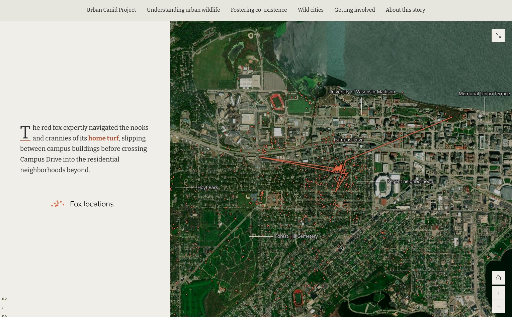

# Drop caps
This example demonstrates how to create

## Live sample
[](https://codepen.io/Warren-Davison/pen/PoMbVjy)*[Click to see the live codepen](https://codepen.io/Warren-Davison/pen/PoMbVjy)*

## Usage instructions
Implementing drop caps in your story involves:
- Creating a CSS selector to select to first letter of `<p>`

>Note: Drop caps are most effective when used sparingly. It is best when used on **the first paragraph of a story or the beginning of main sections** within your story. Therefore a more narrow CSS selector or selective application should be used ([see this sample](https://github.com/WarrenDz/agsm-story-overrides/blob/master/custom-styling/section-color)).

### CSS customizations
**CSS selector**
```css
/* Drop caps selector  */
div.layout-wrapper:first-of-type div.text-viewer p:first-of-type::first-letter {
    ...
}
```

**Drop cap styling** 
```css
div.layout-wrapper:first-of-type div.text-viewer p:first-of-type::first-letter {
    margin: 0.6rem .6rem 0 0;
    float: left;
    color: #313130;
    font-size: calc(2 * 1.4em); /* calculate ~2x the line height (1.65) */
    line-height: .9;
    border-bottom: 2px solid #AA5939 /* Border along the bottom of the drop cap */
}
```