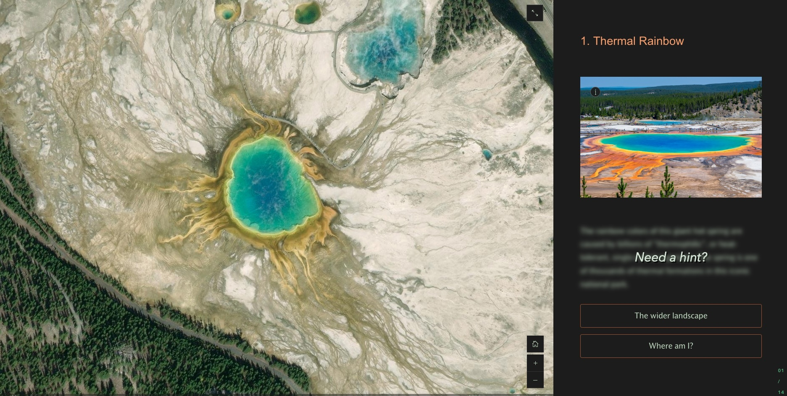

# Hidden hints
Creating geographic scavenger hunts and quizzes using ArcGIS StoryMaps can be an engaging way to test the knowledge of your readers. Customizing the appearance and behavior of text blocks within the story can add an extra element of creativity.

This sample demonstrates how to use psuedo elements and filters to hide blocks of text within the narrative panel of the sidecar until a reader hovers on them. This can be used to mask hint text and add intrigue.

## Live sample
[](https://codepen.io/Warren-Davison/pen/wvVzwrv)*[Click to see the live codepen](https://codepen.io/Warren-Davison/pen/wvVzwrv)*

## Usage instructions
Implementing these hidden hints involves:
- Using filters to blur the text within the `immersive-narrative-panel`.
- Creating a 'Need a hint?' prompt using a pseudo element `::before` the `immersive-narrative-panel` text.
- Removing the blur and hiding the 'Need a hint?' prompt on `:hover`.

### CSS snippet
**Blur the text block within the sidecar narrative panel**: This blurs the `p` elements within the `immersive-narrative-panel` by `5px` using `filter: blur(5px);`.

It also sets the length of the transition or fading in/out of the blur to take 1 second with `transition: 1s ease-in-out;`.
```css
/* Blurring the default state of all p elements that live within an immersive sidecar */
div.immersive-narrative-panel p {
    filter: blur(5px);
    transition: 1s ease-in-out;
}
```

**Create a hint prompt**: This creates a centered 'Need a hint?' prompt atop `div.text-viewer` elements that contain `p` elements within the `immersive-narrative-panel`. 
```css
/* Adds pseudo hint text atop p elements within immersive-narrative-panel text-viewer elements */
div.immersive-narrative-panel div.text-viewer:has(> p)::before {
    content: "Need a hint?";
    color: #dceadb;
    font-weight: bold;
    font-size: 300%;
    font-style: italic;
    text-shadow: 3px 3px #000000;
    position: absolute;
    z-index: -1;
    width: 100%;
    height: 100%;
    display: flex;
    justify-content: center;
    align-items: center;
    opacity: 1;
    transition: 1s ease-in-out;
  }
```

**Hide the effect on hover**: These `:hover` states remove the blur and hide the 'Need a hint?' prompt.
```css
/* Unblur the p elements upon hover */
div.immersive-narrative-panel p:hover {
    filter: blur(0px);
}

/* Hide the pseudo hint text on hover */
div.immersive-narrative-panel div.text-viewer:hover::before {
    opacity : 0;
}
```
