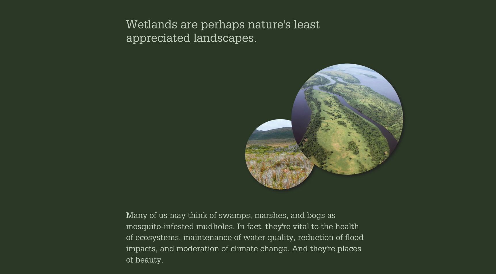

# Image shadow
Adding a drop shadow to standalone graphics in your story can help them stand out and add visual depth to your story.

The shadow will only be created around **non-transparent pixels** within the image so PNGs work well with this effect.

## Live sample
[](https://codepen.io/Warren-Davison/pen/RwXoYJV)*[Click to see the live codepen](https://codepen.io/Warren-Davison/pen/RwXoYJV)*

## Usage instructions
Implementing drop shadows for your images involves:
- Creating a CSS selector that selects all your images (it's a good idea to exclude the image in the cover from this selector).
- Create a CSS drop shadow using `-webkit-filter` and `filter` methods.

### CSS customizations
**CSS selector** The CSS selector has been authored to select all `img` elements **except** those that are within elements that have the `.media-panel` and `.background` which omits `img` elements within the story cover.
```css
img:not(.media-panel.background img) {
    ...
}
```

**Drop shadow** For browser compatibility, this has been implemented with both `filter` and `-webkit-filter` methods.

```css
/* Image drop shadow */
img:not(.media-panel.background img) {
    -webkit-filter: drop-shadow(5px 5px 5px #222) !important;
    filter: drop-shadow(5px 5px 5px #222) !important;
  }
```