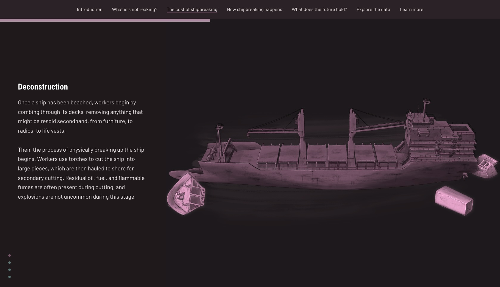

# Scroll progress
This sample demonstrates how to add a progress bar beneath a storys navigation bar in order to visualize a readers progress through the story.

## Live sample
[](https://codepen.io/Warren-Davison/details/ExqZZQL)

## Usage instructions
Implementing a scroll progress bar involves:
- Creating a CSS pseudo element after the navigation bar using `.bar-container::after`.
- Creating a Javascript function to:
    - Determine the height of the story in the page.
    - Calculate the percentage of the page that has been scrolled.
    - Update the `width` of the `.bar-container` with the `percentageScrolled`.
>Provide instructions as to how the author can implement this example. Use the snippet sections below to highlight modifications to the example files.

### CSS customizations
**Create .bar-container::after**
```css
/* Story nav .bar-container */
.bar-container {
  position: relative; /* Ensure the container is positioned relative for absolute positioning */
}

/* Progress bar positioned below the nav .bar-container */
.bar-container::after {
    ...
}
```

**Configure .bar-container::after** with a variable `width`, `transition`, and desired styling.

```css
/* Progress bar positioned below the nav .bar-container */
.bar-container::after {
  content: ""; /* Create an empty pseudo-element */
  display: block; /* Ensure the pseudo-element is rendered */
  position: absolute;
  bottom: -10px; /* Position it 10px below the container */
  left: 0;
  right: 0;
  width: var(--bar-fill-width, 0);
  height: 10px; /* Set the height to 10px */
  background-color: #a88a9e; /* Adjust color as needed */
  transition: width 0.1s ease; /* Smooth animation */
  transition: all 0.3s;
}
```

### Javascript customizations
> Use only if needed. Include a snippet of the business end of the javascript file and direct users where to make modifications.

```js

window.onload = function() {
};      

document.addEventListener(
  "scroll", 
  () => {
    const root = document.querySelector('.storymaps-root');
    
    const rootTop = root.offsetTop;
    const rootHeight = root.offsetHeight;

    const scrollPosition = window.pageYOffset || document.documentElement.scrollTop;
    const rootBottom = rootTop + rootHeight;

    let percentageScrolled;

    if (scrollPosition + window.innerHeight < rootTop) {
      // root div is below the viewport (unlikely, but still...)
      percentageScrolled = 0;
    } else if (scrollPosition > rootBottom) {
      // root div is above the viewport (also unlikely)
      percentageScrolled = 100;
    } else {
      // root div is partially or fully in view
      const distanceScrolled = scrollPosition + window.innerHeight - rootTop;
      percentageScrolled = (distanceScrolled / rootHeight) * 100;
    }

    // Clamp between 0% and 100%, then round the result to the nearest integer
    percentageScrolled = Math.round(Math.max(0, Math.min(percentageScrolled, 100)));

    // Update the CSS width attribute to reflect scroll percentage
    const navProgressBar = document.querySelector('.bar-container');
    navProgressBar.style.setProperty('--bar-fill-width', percentageScrolled + '%');
  }
);
```