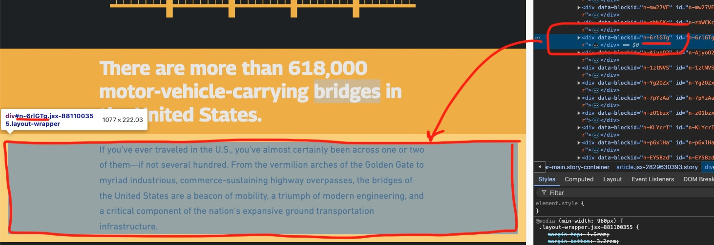

# Selective section background color
Selectively styling the background color for elements within your story can emphasize sections and draw readers attention or to visually separate sections of a story.

## Live sample
[](https://codepen.io/Warren-Davison/pen/vYoyzzm)*[Click to see the live codepen](https://codepen.io/Warren-Davison/pen/vYoyzzm)*

## Usage instructions
In order to selectively color the background of sections of your story, you'll need to:
- Identify the `data-blockid` of the sections you'd like to style.
- Apply a `background-color` and `border
- Optional: Update the `color` of text within those sections for legibility.

>**Note:** the `data-blockid` values are set when a story is published. If a story is edited again, and block are re-arranged or removed, you may need to update the `data-blockid` values in your CSS selectors.

### CSS customizations
**Identify selected blocks** The `data-blockid` values can be found by inspecting the elements of your story. These values can be aggregated into a CSS selector as shown below.


```css
/* Change background color of these 'blocks' */
[data-blockid='n-zbWCKc'],
[data-blockid='n-6rlGTg'],
[data-blockid='n-7pYzAa'],
[data-blockid='n-zO1bzx'] {
    ...
}
```

**Apply styling** Each 'block' in a story has `margin: 16;` in order to style the background of a adjacent sections so they appear as one, this margin is removed and `border-width: 16px;` is applied in its place. This ensures that the visual spacing remains between sections but fills that space with the background color. 
```css
[<data-blockids>] {
    background-color: #F2B940 !important;
    border-color: #F2B940;
    border-style: solid;
    border-width: 16px;
    margin: 0 !important;
}
```

**Optional: Update text color** The `color` of `<p>` elements within the same `data-blockid` selector can be updated to ensure legibility.
```css
/* Change text color in these 'blocks' */
[data-blockid='n-zbWCKc'] p,
[data-blockid='n-6rlGTg'] p,
[data-blockid='n-7pYzAa'] p,
[data-blockid='n-zO1bzx'] p {
    color: #1F2429 !important;
}
```