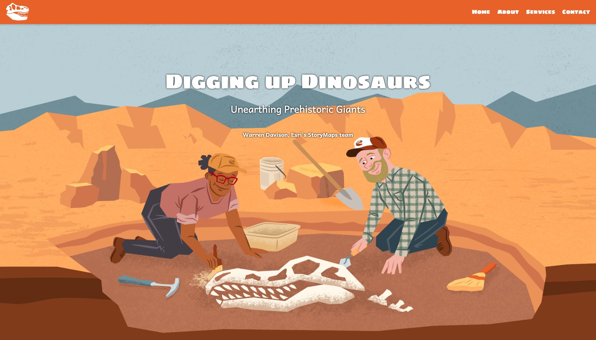

# Custom header and footer
Does your organization employ a custom header and footer for its websites? It's a common approach to ensure a uniform web experience and simplify navigation across pages. By self-hosting your story, you can integrate a custom header and footer around your content, creating a seamless online experience for your audience.

## Live sample
[](https://codepen.io/Warren-Davison/pen/VwoPPQR)*[Click to see the live codepen](https://codepen.io/Warren-Davison/pen/VwoPPQR)*
## Usage instructions
Implementing a customer header and footer involves:
- Creating a header element in your page.
- Creating a footer element in your page.
- Styling these elements.

### HTML customizations

**Header section** The header can contain site navigation or other links as required by your organization.
```html
<!-- Header Section -->
<header>
    <!-- Logo as SVG -->
    <div class="logo">
        <!-- Simple SVG logo (you can replace this with any other SVG code) -->
        
    </div>

    <!-- Navigation Tabs -->
    <nav class="nav-tabs">
        <a href="#home">Home</a>
        <a href="#about">About</a>
        <a href="#services">Services</a>
        <a href="#contact">Contact</a>
    </nav>
</header>
```

**Footer section** This section can contain contact links and various other legal links as required by your organization.
```html
<!-- Footer Section -->
<footer>
    <p>&copy; 2024 Your Company Name. All rights reserved.</p>
    <a href="#privacy-policy">Privacy Policy</a>
    <a href="#terms-of-service">Terms of Service</a>
    <a href="#contact">Contact Us</a>
</footer>
```
### CSS customizations

**Styling the header and footer** The header and footer of your webpage can be styled to align with branding elsewhere on your site.
```css
  /* Header Styles */
  header {
    background-color: #e46116;
    display: flex;
    align-items: center;
    justify-content: space-between;
    padding: 10px 20px;
    color: white;
    position: sticky;
    top: 0;
    z-index: 1000; /* Ensure it stays on top of other elements */
    box-shadow: 0 2px 5px rgba(0, 0, 0, 0.2); /* Add shadow for better visibility */
    font-family: "Sigmar One";
  }
  
  .nav-tabs {
    display: flex;
    gap: 20px;
  }
  
  .nav-tabs a {
    color: white;
    text-decoration: none;
    font-size: 16px;
  }
  
  .nav-tabs a:hover {
    text-decoration: underline;
  }

  /* Footer Styles */
  footer {
    background-color: #e46116;
    color: white;
    padding: 20px;
    text-align: center;
  }
  
  footer a {
    color: white;
    text-decoration: none;
    margin: 0 15px;
  }
  
  footer a:hover {
    text-decoration: underline;
  }
```
