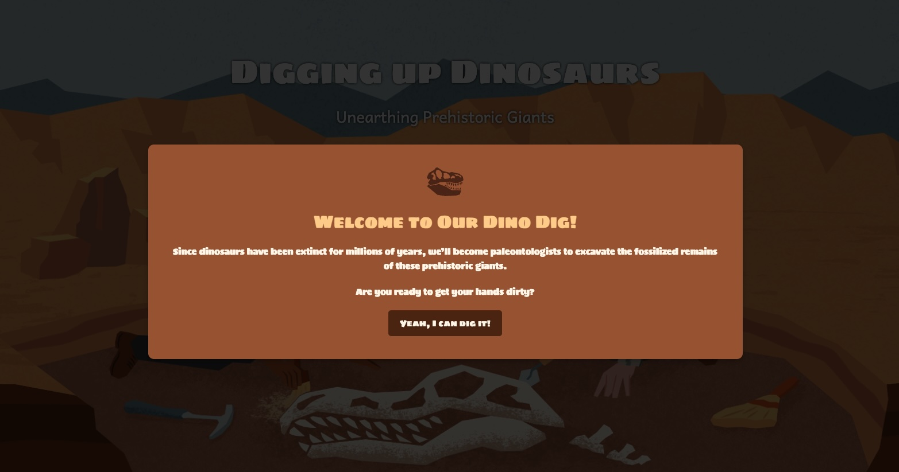

# Splash Screen
>Summarize what this sample does and **what problem is solves for the user**. For example, introduce the sample in the context of a user story. One paragraph is probably enough.

## Usage instructions
>Provide instructions as to how the author can implement this example. Use the snippet sections below to highlight modifications to the example files.

### HTML snippet
> Use only if needed. Include a snippet of the business end of the HTML and direct users where to make modifications.

```
// Your code here (comments are allowed)
```

### CSS snippet
> Use only if needed. Include a snippet of the business end of the CSS file and direct users where to make modifications.

```
// Your code here (comments are allowed)
```

### Javascript snippet
> Use only if needed. Include a snippet of the business end of the javascript file and direct users where to make modifications.

```
// Your code here (comments are allowed)
```

## Example output
>Describe the result, and include a description of the result (screenshot or GIF).

